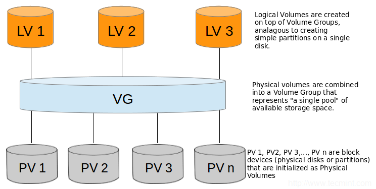

# Ubuntu 擴充伺服器磁碟空間

> 感謝銘祐兄開給我更多的空間！

> Written by [@xxrjun](https://github.com/xxrjun)

## 前情提要

一開始伺服器的磁碟空間有 30GB，今天(2023/03/17)不過是下載完 MetaMap 的壓縮檔就發現磁碟爆了(一開始分割的時候只有分配 14GB)，雖然可以把剩下的 10GB 多可以分配過去，但是！

1. 我不會做擴充磁碟或是磁碟分割有的沒的，所以想說可以順便學
2. MetaMap 解壓縮就 16G 了，之後還要裝資料庫的東西，所以現在不弄未來還是得弄！但修了 29 學分的我可不想拖任何事！

在銘祐擴大 vm disk 的容量之前，輸入 `lsblk` 看一下磁碟分割的狀況，總共有 30G，我們主要是使用 `sda3` 的區域，有 28G

```shell
$ lsblk
NAME                 MAJ:MIN RM   SIZE RO TYPE MOUNTPOINTS
loop0                  7:0    0 116.8M  1 loop /snap/core/14784
loop1                  7:1    0  55.6M  1 loop /snap/core18/2708
loop2                  7:2    0  55.6M  1 loop /snap/core18/2714
loop3                  7:3    0  63.3M  1 loop /snap/core20/1828
loop4                  7:4    0    62M  1 loop /snap/core20/1587
loop5                  7:5    0 139.4M  1 loop /snap/docker/2746
loop6                  7:6    0   338M  1 loop /snap/google-cloud-sdk/324
loop7                  7:7    0 339.5M  1 loop /snap/google-cloud-sdk/326
loop8                  7:8    0  79.9M  1 loop /snap/lxd/22923
loop9                  7:9    0 111.9M  1 loop /snap/lxd/24322
loop10                 7:10   0  38.7M  1 loop /snap/postgresql10/47
loop11                 7:11   0  70.8M  1 loop /snap/powershell/229
loop12                 7:12   0  49.8M  1 loop /snap/snapd/18357
loop13                 7:13   0  70.8M  1 loop /snap/powershell/231
sda                    8:0    0    30G  0 disk
├─sda1                 8:1    0     1M  0 part
├─sda2                 8:2    0     2G  0 part /boot
└─sda3                 8:3    0    28G  0 part
  └─ubuntu--vg-ubuntu--lv
```

接著輸入 `df -hl` 看一下檔案系統的使用情況，我們主要檔案是放置在 `/dev/mapper/ubuntu--vg-ubuntu--lv` ，只剩下 37MB 可以用了:anguished: ，勢必得進行擴充，就算把 `sda3` 全部的空間分下去，MetaMap 一解壓縮就會爆了。

```shell
$ df -hl
Filesystem                         Size  Used Avail Use% Mounted on
tmpfs                              795M  1.1M  794M   1% /run
/dev/mapper/ubuntu--vg-ubuntu--lv   14G   13G   37M 100% /
tmpfs                              3.9G     0  3.9G   0% /dev/shm
tmpfs                              5.0M     0  5.0M   0% /run/lock
/dev/sda2                          2.0G  130M  1.7G   8% /boot
tmpfs                              795M  4.0K  795M   1% /run/user/1000
```

跟銘祐說後我需要多一點空間後，銘祐二話不說馬上幫我開到 80GB(真的非常感謝！)，接著就是我要想辦法完成擴充磁碟的環節了。

## 弄髒手

> 題外話: 一開始銘祐是多給我一顆 50GB 的 vm disk，正當我還在懊惱怎麼動手時，銘祐發現可以讓原本的 vm disk 直接擴充容量，應該是有讓接下來的程序變得簡單一點！

vm disk 擴容後，輸入 `lsblk` 查看，`sda` 從原本的 30G 變成 80G 了！

```shell
$ lsblk
NAME                      MAJ:MIN RM   SIZE RO TYPE MOUNTPOINTS
loop0                       7:0    0  55.6M  1 loop /snap/core18/2708
loop1                       7:1    0 116.8M  1 loop /snap/core/14784
loop2                       7:2    0  63.3M  1 loop /snap/core20/1828
loop3                       7:3    0    62M  1 loop /snap/core20/1587
loop4                       7:4    0 139.4M  1 loop /snap/docker/2746
loop5                       7:5    0  55.6M  1 loop /snap/core18/2714
loop6                       7:6    0   338M  1 loop /snap/google-cloud-sdk/324
loop7                       7:7    0 339.5M  1 loop /snap/google-cloud-sdk/326
loop8                       7:8    0  79.9M  1 loop /snap/lxd/22923
loop9                       7:9    0 111.9M  1 loop /snap/lxd/24322
loop10                      7:10   0  38.7M  1 loop /snap/postgresql10/47
loop11                      7:11   0  70.8M  1 loop /snap/powershell/229
loop12                      7:12   0  70.8M  1 loop /snap/powershell/231
loop13                      7:13   0  49.8M  1 loop /snap/snapd/18357
sda                         8:0    0    80G  0 disk
├─sda1                      8:1    0     1M  0 part
├─sda2                      8:2    0     2G  0 part /boot
└─sda3                      8:3    0    28G  0 part
  └─ubuntu--vg-ubuntu--lv 253:0    0    14G  0 lvm  /
```

因為我沒找到擴充現有分割區的方法，所以我選擇將 `sda3` 刪掉再新增一個擁有剩下全部空間的分割區。 輸入 `fdisk /dev/sda`，並針對提示輸入，以下是會用到的指令

- `n` : 建立新分割槽
- `d` : 刪除原有分割槽
- `p` : 檢視分割區
- `w` : 儲存分割區並退出

```shell
Command (m for help): d
Partition number (1-3, default 3): 3

Partition 3 has been deleted.

Command (m for help): n
Partition number (3-128, default 3): 3
First sector (4198400-167772126, default 4198400):  // 這裡按Enterr就好
Last sector, +/-sectors or +/-size{K,M,G,T,P} (4198400-167772126, default 167772126):  // 這裡按Enter就好

Created a new partition 3 of type 'Linux filesystem' and of size 78 GiB.
Partition #3 contains a LVM2_member signature.

Do you want to remove the signature? [Y]es/[N]o: n  # 這行我不知道要幹嘛，但看到 remove 怕出錯就選擇 No

Command (m for help): p

Disk /dev/sda: 80 GiB, 85899345920 bytes, 167772160 sectors
Disk model: QEMU HARDDISK
Units: sectors of 1 * 512 = 512 bytes
Sector size (logical/physical): 512 bytes / 512 bytes
I/O size (minimum/optimal): 512 bytes / 512 bytes
Disklabel type: gpt
Disk identifier: 98221D5A-EB1E-4412-8F70-4C9F40EF706A

Device       Start       End   Sectors Size Type
/dev/sda1     2048      4095      2048   1M BIOS boot
/dev/sda2     4096   4198399   4194304   2G Linux filesystem
/dev/sda3  4198400 167772126 163573727  78G Linux filesystem

Command (m for help): w
The partition table has been altered.
Syncing disks.
```

建立後需要輸入 `reboot` 重新啟動即可生效(好像也可以透過重新掛載來生效)

```shell
$ reboot
```

接著我們需要使用 `pvresize` 指令調整 `/dev/sda3` 物理卷(Physical Volume) 大小。透過這個指令，LVM 會重新計算物理卷中可用的空間，並且能夠使用及管理新增的空間。

```shell
$ pvresize /dev/sda3
1 physical volume(s) resized or updated / 0 physical volume(s) not resized
```

使用 `pvdisplay` 確認一下，`/dev/sda3` 的 `PV Size` 確實增加 50GB 至 78GB 了。

```shell
$ pvdisplay
--- Physical volume ---
PV Name               /dev/sda3
VG Name               ubuntu-vg
PV Size               <78.00 GiB / not usable 16.50 KiB
Allocatable           yes
PE Size               4.00 MiB
Total PE              19967
Free PE               12800
Allocated PE          7167
PV UUID               g6WsDR-nJP3-YYYv-72b7-wRQB-51bs-G2Kj4A
```

此指令執行後，若是 `dev/sda3` 有多餘的空間，似乎會自動分配給其所屬的 Volume Group，進而改變 `VG SIZE`，這邊改變的很顯然是`ubuntu-vg`，使用 `vgdisplay` 檢查，`ubuntu-vg` 的 `VG Size` 確實變為 78GB

```shell
$ vgdisplay
--- Volume group ---
VG Name               ubuntu-vg
System ID
Format                lvm2
Metadata Areas        1
Metadata Sequence No  5
VG Access             read/write
VG Status             resizable
MAX LV                0
Cur LV                1
Open LV               1
Max PV                0
Cur PV                1
Act PV                1
VG Size               <78.00 GiB
PE Size               4.00 MiB
Total PE              19967
Alloc PE / Size       19967 / <78.00 GiB
Free  PE / Size       0 / 0
VG UUID               xVsU8T-uO85-oDID-5809-pWVu-bGfH-2snBHs
```

接著使用 LVM 擴展 `/dev/ubuntu-vg/ubuntu-lv` 的 Logical Volume 大小，以便能夠利用前面使用 `pvresize` 擴展的空間。

- `lvextend` 為 LVM 指令，用於擴展 LV(Logical Volume) 的容量。
- `l +100%FREE` 表示擴展大小為目前 VG 中所有可用空間的 100%。
- `/dev/ubuntu-vg/ubuntu-lv` 為要擴展的 LV 名稱。

```shell
$ lvextend -l +100%FREE /dev/ubuntu-vg/ubuntu-lv
Size of logical volume ubuntu-vg/ubuntu-lv changed from <28.00 GiB (7167 extents) to <78.00 GiB (19967 extents).
Logical volume ubuntu-vg/ubuntu-lv successfully resized.
```

最後使用 `resize2fs` 調整檔案系統可用大小，使其與 LV 的大小相符。因為在擴展 LV 大小後，磁盤上的文件系統大小並不會自動跟著擴展，所以必須透過這個指令來調整文件系統大小。

```shell
$ resize2fs /dev/ubuntu-vg/ubuntu-lv
resize2fs 1.46.5 (30-Dec-2021)
Filesystem at /dev/ubuntu-vg/ubuntu-lv is mounted on /; on-line resizing required
old_desc_blocks = 4, new_desc_blocks = 10
The filesystem on /dev/ubuntu-vg/ubuntu-lv is now 20446208 (4k) blocks long.
```

Finally！

```shell
$ df -h
Filesystem                         Size  Used Avail Use% Mounted on
tmpfs                              795M  1.1M  794M   1% /run
/dev/mapper/ubuntu--vg-ubuntu--lv   77G   13G   61G  18% /
tmpfs                              3.9G     0  3.9G   0% /dev/shm
tmpfs                              5.0M     0  5.0M   0% /run/lock
/dev/sda2                          2.0G  130M  1.7G   8% /boot
tmpfs                              795M  4.0K  795M   1% /run/user/1000
```

## 總結與補充

### 總結步驟

1. 調整 Disk 大小
2. 建立分割區，並使用預設大小，也就是剩餘的全部容量
3. 調整 `sda3` PV 大小，進而影響 VG 的大小
4. 調整 LV 大小
5. 調整檔案系統大小

### 補充說明 Physical Volume(PV) 與 Logical Volume(LV)

在 LVM（Logical Volume Manager）架構下，物理硬碟空間會被劃分成一個或多個 Physical Volumes（PV），而每個 Physical Volume 可能包含一或多個 Volume Groups（VG）。

一個 Volume Group 可以由多個 Physical Volumes 組成，而 Logical Volume（LV）就是在 Volume Group 上創建出的邏輯分割區。在 LV 建立後，就可以像一般分割區一樣，進行格式化和掛載。

PV 是將物理硬碟的空間劃分成一個或多個邏輯單位，可以理解為是物理硬碟的切割區塊；而 LV 則是將 Volume Group 的空間再次切割，變成可以使用的邏輯區塊。LV 和 PV 之間的差異在於對於使用者而言，PV 是物理區塊，而 LV 則是邏輯區塊。使用者可以把一個或多個 LV 的空間配置到一個或多個 PV 上，而這些 PV 可以屬於不同的物理硬碟。在 LV 內部，文件系統被格式化並用來儲存數據。



## 後記

下午弄了兩個多小時才搞定，本來因為覺得很麻煩所以乾脆砍掉原本資料重裝，但我把分割區 `sda3` 刪掉重裝後原本的資料居然還在，完全不知道為啥，希望不會有什麼後遺症。第一次弄磁碟相關的東東，怕未來忘記所以打這篇記下。

非常感謝提供資源的銘祐以及整個[Cloud Infrastructure Lab](https://www.facebook.com/NCU.CILab/about)團隊，也希望專題能夠順順利利。

## 參考資料(Referneces)

- https://askubuntu.com/questions/1215404/lvm-expansion-problem
- http://webnas.bhes.ntpc.edu.tw/wordpress/wp-content/uploads/2019/06/虛擬機房Linux硬碟擴充教學.pdf
